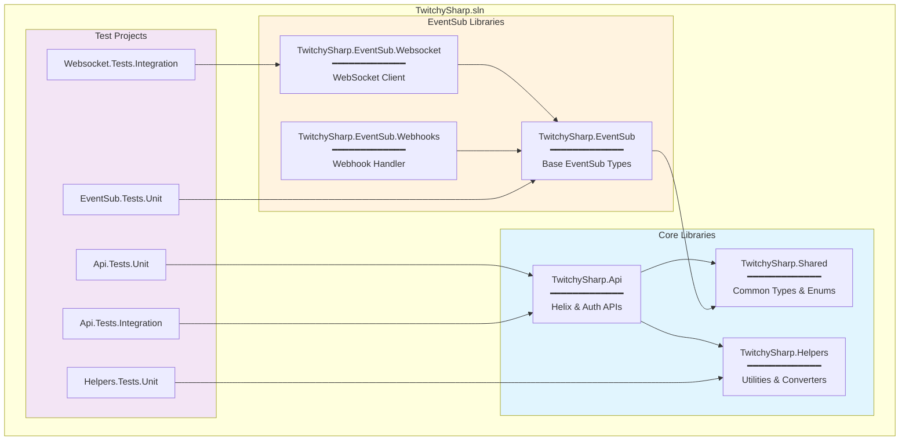
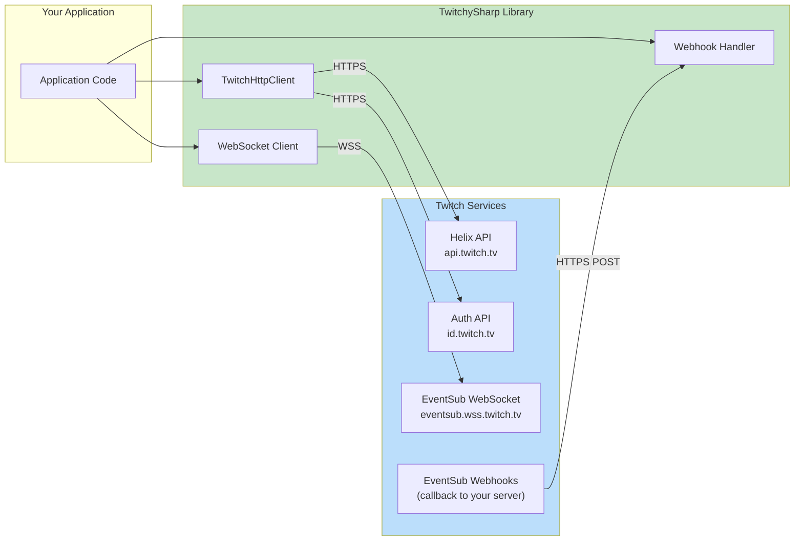
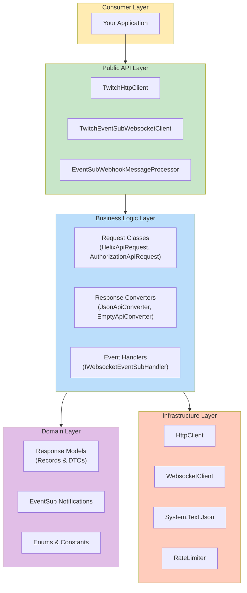
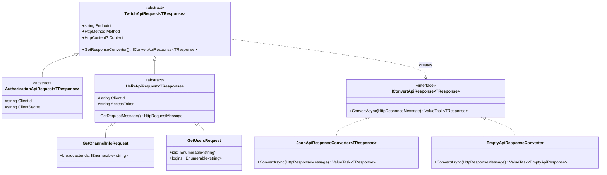
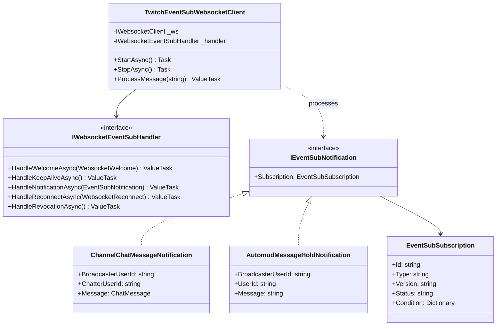
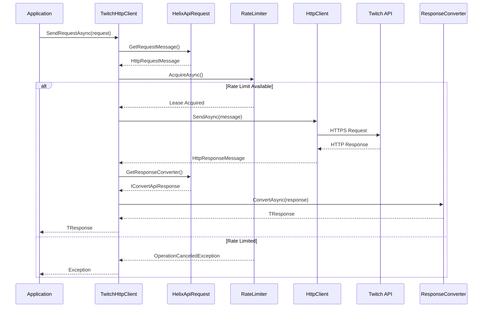
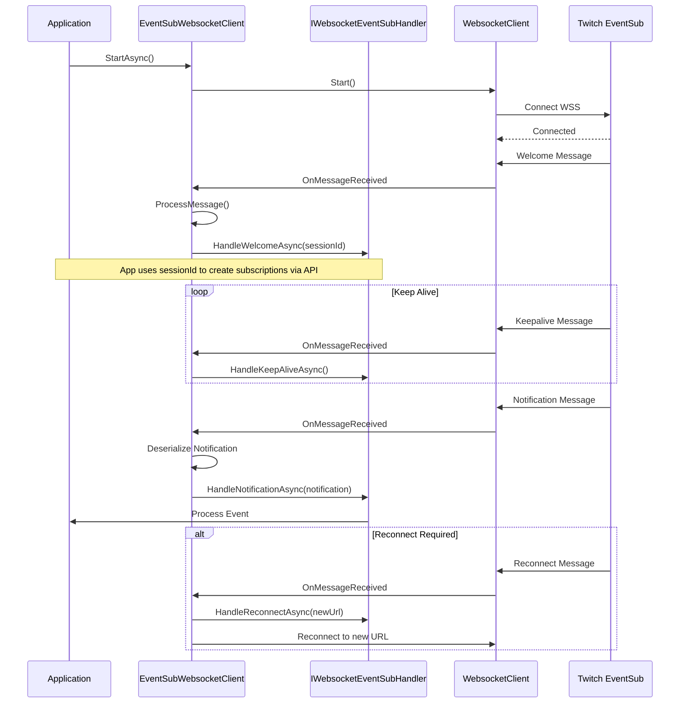
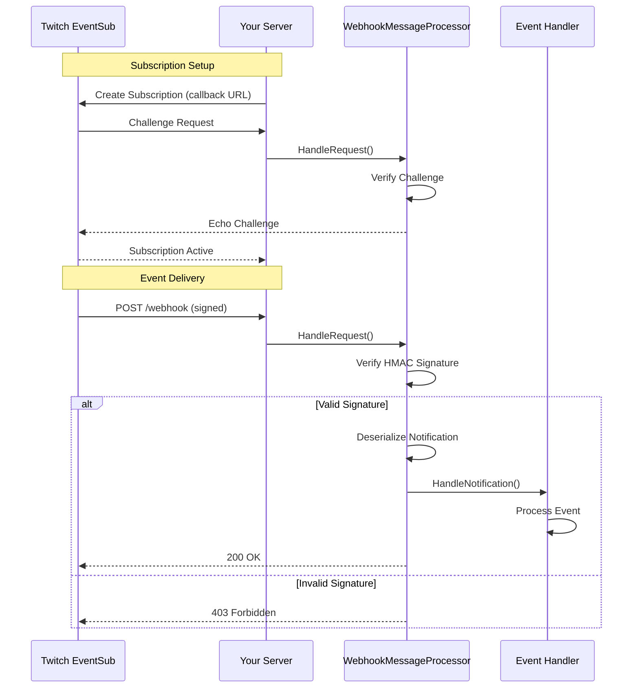
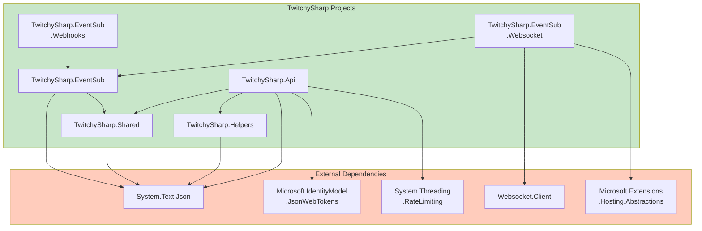

# TwitchySharp Architecture

This document provides an overview of the TwitchySharp library architecture using standard software architecture diagrams.

## Table of Contents

- [Solution Structure](#solution-structure)
- [Component Diagram](#component-diagram)
- [Layer Architecture](#layer-architecture)
- [Class Diagrams](#class-diagrams)
  - [API Request Hierarchy](#api-request-hierarchy)
  - [EventSub Components](#eventsub-components)
- [Sequence Diagrams](#sequence-diagrams)
  - [API Request Flow](#api-request-flow)
  - [WebSocket EventSub Flow](#websocket-eventsub-flow)
  - [Webhook EventSub Flow](#webhook-eventsub-flow)
- [Dependency Graph](#dependency-graph)

---

## Solution Structure

Overview of all projects in the solution and their purpose.

---

## Component Diagram

High-level view of how TwitchySharp interacts with external systems.

---

## Layer Architecture

The library follows a layered architecture pattern.

---

## Class Diagrams

### API Request Hierarchy

The request class hierarchy enables type-safe API calls with built-in authentication.

### EventSub Components

Components involved in EventSub real-time notifications.

---

## Sequence Diagrams

### API Request Flow

How a typical Helix API request flows through the system.

### WebSocket EventSub Flow

Real-time event subscription via WebSocket.

### Webhook EventSub Flow

Server-to-server event delivery via webhooks (planned implementation).

---

## Dependency Graph

NuGet package dependencies for each project.

---

## Key Design Patterns

| Pattern | Usage | Location |
|---------|-------|----------|
| **Strategy** | Response converters for different response types | `IConvertApiResponse<T>` |
| **Template Method** | Base request classes define structure | `TwitchApiRequest<T>` |
| **Factory** | Converter creation via attributes | `ApiConverterAttribute` |
| **Observer** | Event handling in WebSocket client | `IWebsocketEventSubHandler` |
| **Adapter** | Wrapping external WebSocket library | `TwitchEventSubWebsocketClient` |

---

## Technology Stack

| Component | Technology |
|-----------|------------|
| **Framework** | .NET 8.0 |
| **Language** | C# 12 (latest) |
| **Serialization** | System.Text.Json |
| **HTTP Client** | HttpClient (built-in) |
| **WebSocket** | Websocket.Client |
| **Rate Limiting** | System.Threading.RateLimiting |
| **JWT Handling** | Microsoft.IdentityModel.JsonWebTokens |
| **Testing** | xUnit |
