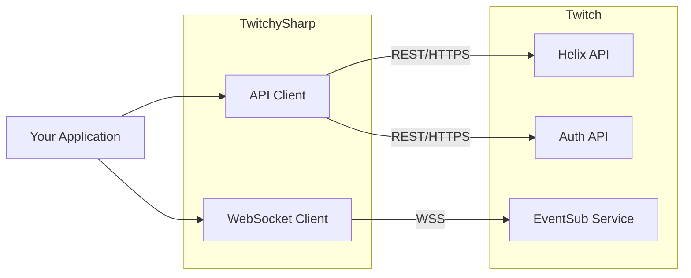
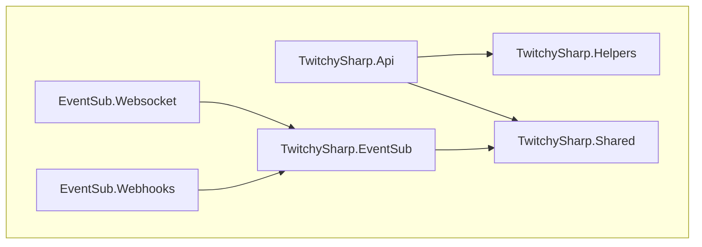
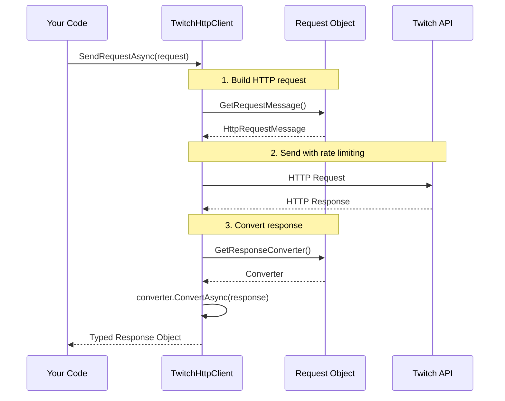
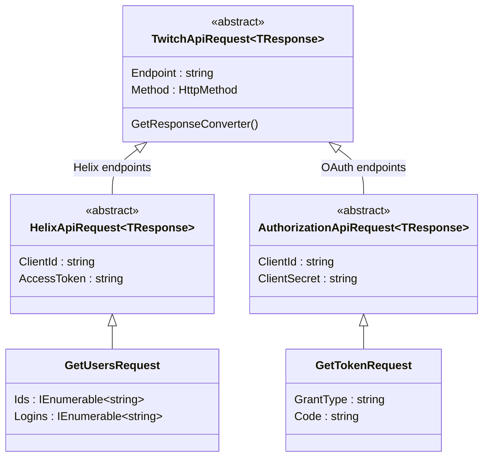
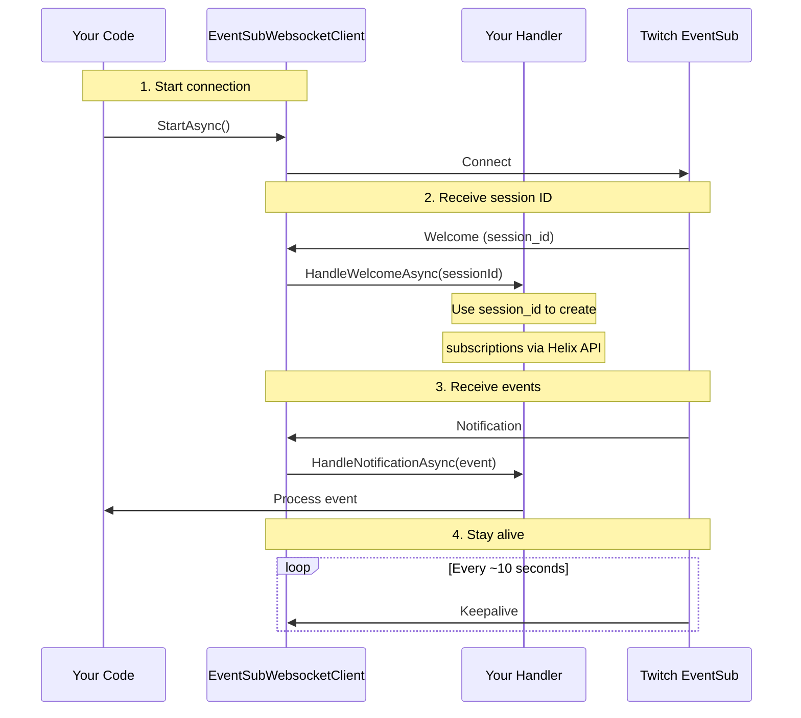
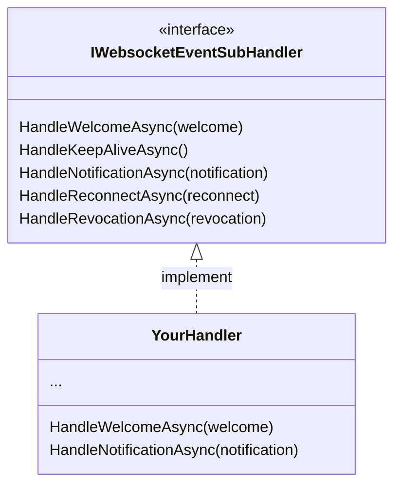

# TwitchySharp Architecture

> A developer's guide to understanding and contributing to TwitchySharp

---

## Overview

TwitchySharp is a .NET 8 library that wraps the Twitch API. It provides three main capabilities:

| Capability | What it does | Status |
|------------|--------------|--------|
| **Helix API** | Call any Twitch REST endpoint | Complete |
| **EventSub WebSocket** | Receive real-time events via persistent connection | Complete |
| **EventSub Webhooks** | Receive real-time events via HTTP callbacks | Not implemented |

---

## Quick Orientation

**"I want to make an API call"** → Start in `TwitchySharp.Api/Helix/`

**"I want to receive real-time events"** → Start in `TwitchySharp.EventSub.Websocket/`

**"I want to understand the request/response pattern"** → See [How API Requests Work](#how-api-requests-work)

**"I want to add a new Helix endpoint"** → See [Adding a New Endpoint](#adding-a-new-endpoint)

---

## System Context

How TwitchySharp fits into the bigger picture.



---

## Project Structure

The solution contains 11 projects organized into three groups.

```
TwitchySharp.sln
│
├── Core Libraries (you'll work with these most)
│   ├── TwitchySharp.Api            # Helix + Authorization endpoints
│   ├── TwitchySharp.Helpers        # JSON converters, query builders
│   └── TwitchySharp.Shared         # Enums, constants shared across projects
│
├── EventSub Libraries
│   ├── TwitchySharp.EventSub           # Base types for real-time events
│   ├── TwitchySharp.EventSub.Websocket # WebSocket implementation
│   └── TwitchySharp.EventSub.Webhooks  # Webhook implementation (stub)
│
└── Test Projects
    ├── *.Tests.Unit                # Fast, isolated tests
    └── *.Tests.Integration         # Tests against real Twitch API
```

### Project Dependencies



**Key insight:** `Shared` is at the bottom of the dependency tree. Types that need to be used across multiple projects belong there.

---

## How API Requests Work

Every Twitch API call follows the same pattern. Understanding this unlocks the entire codebase.

### The Request Pipeline



### The Class Hierarchy

All API requests inherit from a common base. This provides consistent authentication and response handling.



**Key insight:**
- Helix endpoints use `HelixApiRequest` (user/app access token)
- OAuth endpoints use `AuthorizationApiRequest` (client credentials)

---

## How EventSub Works

EventSub delivers real-time notifications when things happen on Twitch (new follower, chat message, stream went live, etc.)

### WebSocket Flow



### Handler Interface

You implement `IWebsocketEventSubHandler` to receive events:



---

## Key Abstractions

### Response Converters

Different endpoints return different response shapes. Converters handle this:

| Converter | Used When | Example |
|-----------|-----------|---------|
| `JsonApiResponseConverter<T>` | Endpoint returns JSON body | GET /users |
| `EmptyApiResponseConverter` | Endpoint returns 204 No Content | DELETE /subscriptions |
| Custom | Special handling needed | Pagination, streaming |

### Query Parameter Builder

`HttpQueryParameters` builds URL query strings:

```csharp
// Produces: ?broadcaster_id=123&broadcaster_id=456
new HttpQueryParameters()
    .Add("broadcaster_id", new[] { "123", "456" })
```

---

## Adding a New Endpoint

To add a new Helix endpoint:

1. **Create the request class** in `TwitchySharp.Api/Helix/{Category}/Requests/`
2. **Create the response record** in `TwitchySharp.Api/Helix/{Category}/Responses/`
3. **Add an integration test** in `TwitchySharp.Api.Tests.Integration/`

Example request:

```csharp
public class GetChannelInformationRequest(
    string clientId,
    string accessToken,
    IEnumerable<string> broadcasterIds)
    : HelixApiRequest<GetChannelInformationResponse>(
        "/channels" + new HttpQueryParameters()
            .Add("broadcaster_id", broadcasterIds),
        clientId,
        accessToken);
```

**The pattern:**
- Constructor takes auth + endpoint-specific params
- Base class takes endpoint path + auth
- Response type is specified as generic parameter

---

## External Dependencies

| Package | Purpose | Used By |
|---------|---------|---------|
| System.Text.Json | JSON serialization | All projects |
| Microsoft.IdentityModel.JsonWebTokens | JWT validation | Api (Extensions) |
| System.Threading.RateLimiting | Rate limit compliance | Api |
| Websocket.Client | WebSocket connection | EventSub.Websocket |

---

## Design Decisions

| Decision | Rationale |
|----------|-----------|
| Records for responses | Immutability, value equality, concise syntax |
| Primary constructors | Reduce boilerplate in request classes |
| Abstract base classes (not interfaces) | Share implementation, not just contract |
| snake_case JSON | Match Twitch API conventions |
| Separate Shared project | Avoid circular dependencies between Api and EventSub |

---

## Areas Needing Work

| Area | Issue | Difficulty |
|------|-------|------------|
| Webhooks | Completely unimplemented | Medium |
| EventSub models | Only ~6 of 40+ notification types exist | Low (repetitive) |
| Unit tests | Almost none exist | Low |
| URL encoding | `HttpQueryParameters` doesn't encode values | Low |

See the [README](../README.md) for the full TODO list.
