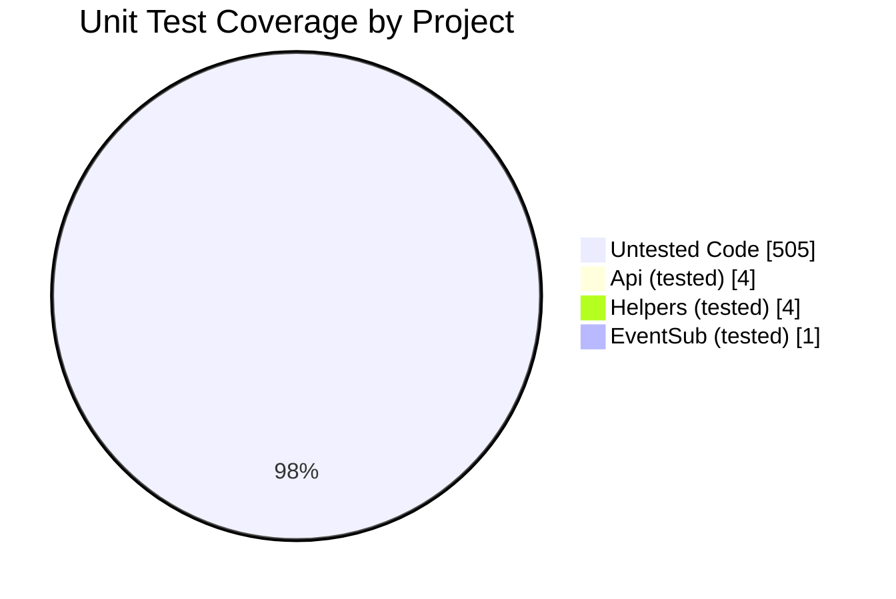
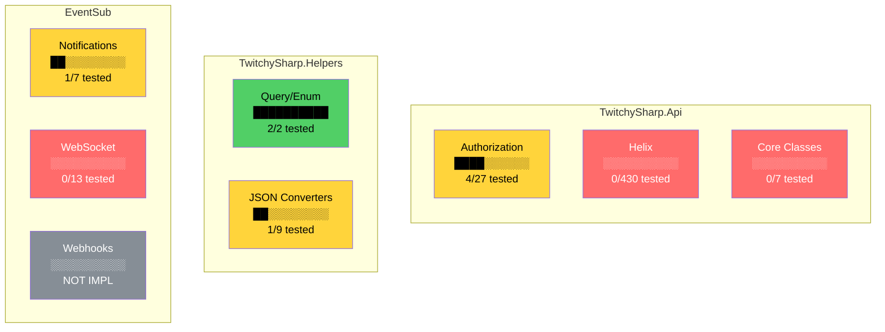
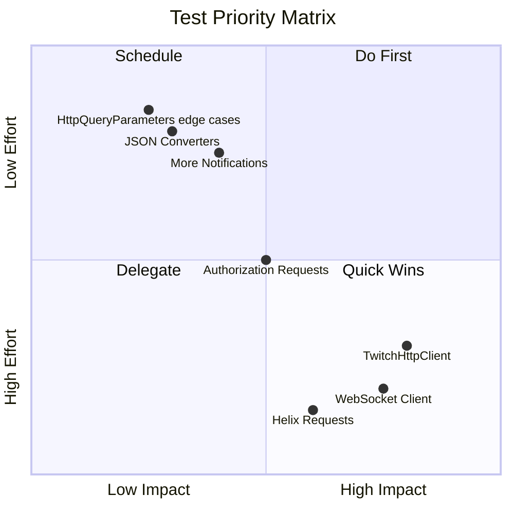

# Test Coverage Overview

> Quick visual reference for unit test coverage

---

## Coverage at a Glance



---

## Project Breakdown

| Project | Coverage | Visual | Status |
|---------|----------|--------|--------|
| **TwitchySharp.Api** | 4 / 472 | `░░░░░░░░░░░░░░░░░░░░` | 🔴 Critical |
| **TwitchySharp.Helpers** | 4 / 11 | `███████░░░░░░░░░░░░░` | 🟡 Partial |
| **TwitchySharp.EventSub** | 1 / 7 | `███░░░░░░░░░░░░░░░░░` | 🟡 Partial |
| **EventSub.Websocket** | 0 / 13 | `░░░░░░░░░░░░░░░░░░░░` | 🔴 None |
| **EventSub.Webhooks** | 0 / 6 | `░░░░░░░░░░░░░░░░░░░░` | ⚫ N/A* |

*\*Webhooks not implemented yet*

---

## Coverage Map



---

## What's Tested vs Not

### TwitchySharp.Api

```
Authorization/
├── 🟢 Scope.cs                    ✓ Tested
├── 🟢 OidcClaim.cs                ✓ Tested
├── 🟢 TwitchOidc.cs               ✓ Tested
├── 🟢 ExtensionJwtPayload.cs      ✓ Tested
├── 🔴 AuthorizationApiRequest.cs  ✗ Not tested
├── 🔴 Requests/ (9 files)         ✗ Not tested
├── 🔴 Responses/ (8 files)        ✗ Not tested
└── 🔴 ClientUrls/ (4 files)       ✗ Not tested

Helix/
└── 🔴 (430 files)                 ✗ Not tested

Core/
├── 🔴 TwitchHttpClient.cs         ✗ Not tested
├── 🔴 TwitchApiRequest.cs         ✗ Not tested
├── 🔴 ApiException.cs             ✗ Not tested
└── 🔴 JsonConfig.cs               ✗ Not tested
```

### TwitchySharp.Helpers

```
├── 🟢 HttpQueryParameters.cs            ✓ Tested
├── 🟢 ValueBackedEnum.cs                ✓ Tested
├── 🔴 ImageUrlTemplate.cs               ✗ Not tested
├── 🔴 TwitchDateTimeOffsetQuery...      ✗ Not tested
│
└── JsonConverters/
    ├── 🟢 ValueBackedEnumJsonConverter  ✓ Tested
    ├── 🔴 EmptyDateTimeOffsetConverter  ✗ Not tested
    ├── 🔴 UnixSecondsDateTimeOffset...  ✗ Not tested
    ├── 🔴 SnakeCaseLower/Upper...       ✗ Not tested
    ├── 🔴 IntStringJsonConverter        ✗ Not tested
    └── 🔴 Minutes/SecondsTimeSpan...    ✗ Not tested
```

### TwitchySharp.EventSub

```
├── 🟢 AutomodMessageHold.cs       ✓ Tested (via NotificationConverter)
├── 🔴 AutomodMessageHoldV2.cs     ✗ Not tested
├── 🔴 ChannelChatMessage.cs       ✗ Not tested
├── 🔴 EventSubSubscription.cs     ✗ Not tested
└── 🔴 EventSubTransport.cs        ✗ Not tested

Websocket/
├── 🔴 TwitchEventSubWebsocket...  ✗ Not tested
├── 🔴 EventSubWebsocketMessage    ✗ Not tested
└── 🔴 (11 more files)             ✗ Not tested

Webhooks/
└── ⚫ (6 files)                    Not implemented
```

---

## Priority Matrix



---

## Quick Wins

These tests can be added with minimal effort:

| Test | Effort | File to Create |
|------|--------|----------------|
| 🟢 Add `[Theory]` attribute | 5 min | `Test_HttpQueryParameters.cs` line 39 |
| 🟢 Test `ChannelChatMessage` | 30 min | `Test_NotificationConverter.cs` |
| 🟢 Test `SecondsTimeSpanJsonConverter` | 30 min | New file in Helpers.Tests.Unit |
| 🟢 Test `IntStringJsonConverter` | 30 min | New file in Helpers.Tests.Unit |

---

## Test Health Dashboard

```
┌─────────────────────────────────────────────────────────────┐
│  UNIT TEST HEALTH                                           │
├─────────────────────────────────────────────────────────────┤
│                                                             │
│  Overall Coverage    ██░░░░░░░░░░░░░░░░░░░░░░░  ~2%        │
│                                                             │
│  ┌─────────────┬──────────────────────────────┐            │
│  │ 🟢 Passing  │  9 tests                     │            │
│  │ 🔴 Missing  │  ~500 potential tests        │            │
│  │ ⚠️  Flaky    │  0 tests                     │            │
│  └─────────────┴──────────────────────────────┘            │
│                                                             │
│  Last Updated: Dec 2024                                     │
└─────────────────────────────────────────────────────────────┘
```

---

## Running Tests

```bash
# All unit tests
dotnet test --filter "FullyQualifiedName~Tests.Unit"

# Specific project
dotnet test TwitchySharp.Api.Tests.Unit
dotnet test TwitchySharp.Helpers.Tests.Unit
dotnet test TwitchySharp.EventSub.Tests.Unit

# With coverage report (requires coverlet)
dotnet test --collect:"XPlat Code Coverage"
```

---

## Contributing

### Test File Naming
```
Test_{ClassName}.cs
```

### Test Method Naming
```
{Method}_{Scenario}_{ExpectedResult}
```

### Example Test Structure
```csharp
[Fact]
public void FormatScopes_MultipleScopes_ReturnsJoinedString()
{
    // Arrange
    var scopes = new[] { Scope.ChatRead, Scope.ChatWrite };

    // Act
    var result = scopes.FormatScopes();

    // Assert
    Assert.Equal("chat:read+chat:write", result);
}
```
