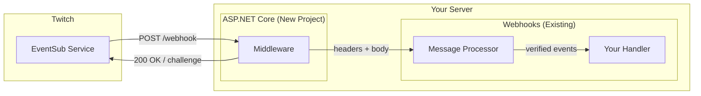
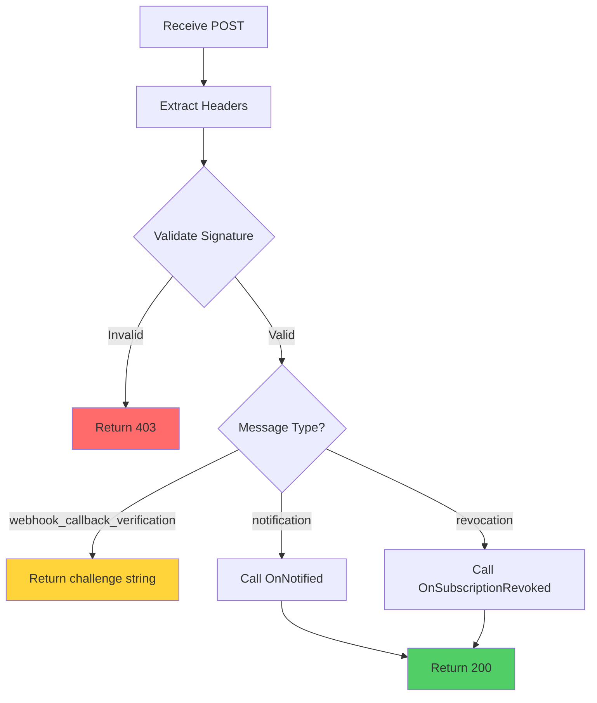

# Webhook Implementation Plan

> Complete EventSub Webhooks with general handler + ASP.NET Core middleware

---

## Overview



---

## Project Structure

```
TwitchySharp.sln
│
├── TwitchySharp.EventSub.Webhooks          # General handler (COMPLETE THIS)
│   ├── IWebhookEventSubHandler.cs          ✓ Exists
│   ├── IEventSubWebhookMessageProcessor.cs ✓ Exists
│   ├── DefaultEventSubWebhookMessageProcessor.cs  ⚠️ Stubbed
│   ├── EventSubWebhookRequestHeader.cs     ✓ Exists
│   ├── WebhookSignatureValidator.cs        🆕 NEW
│   └── Requests/
│       ├── CallbackVerificationRequestData.cs  ✓ Exists
│       └── RevocationRequestData.cs            ✓ Exists
│
└── TwitchySharp.EventSub.Webhooks.AspNetCore   # 🆕 NEW PROJECT
    ├── TwitchEventSubMiddleware.cs
    ├── TwitchEventSubEndpointRouteBuilderExtensions.cs
    ├── TwitchEventSubOptions.cs
    └── ServiceCollectionExtensions.cs
```

---

## Phase 1: Complete Core Webhooks

### 1.1 Signature Validation

Twitch signs all webhook requests with HMAC-SHA256. We must verify before processing.

```
┌─────────────────────────────────────────────────────────────┐
│  HMAC Verification Flow                                     │
├─────────────────────────────────────────────────────────────┤
│                                                             │
│  1. Extract headers:                                        │
│     • Twitch-Eventsub-Message-Id                           │
│     • Twitch-Eventsub-Message-Timestamp                    │
│     • Twitch-Eventsub-Message-Signature                    │
│                                                             │
│  2. Build HMAC message:                                     │
│     message = message_id + timestamp + body                 │
│                                                             │
│  3. Compute signature:                                      │
│     expected = "sha256=" + HMACSHA256(secret, message)     │
│                                                             │
│  4. Compare (timing-safe):                                  │
│     signature == expected ? ✓ Process : ✗ Reject 403       │
│                                                             │
└─────────────────────────────────────────────────────────────┘
```

**New file: `WebhookSignatureValidator.cs`**

```csharp
public static class WebhookSignatureValidator
{
    public static bool Validate(
        string messageId,
        string timestamp,
        string body,
        string signature,
        string secret)
    {
        var message = messageId + timestamp + body;
        var hmac = new HMACSHA256(Encoding.UTF8.GetBytes(secret));
        var hash = hmac.ComputeHash(Encoding.UTF8.GetBytes(message));
        var expected = "sha256=" + Convert.ToHexString(hash).ToLower();

        return CryptographicOperations.FixedTimeEquals(
            Encoding.UTF8.GetBytes(signature),
            Encoding.UTF8.GetBytes(expected));
    }
}
```

---

### 1.2 Message Processing Flow



---

### 1.3 Complete `DefaultEventSubWebhookMessageProcessor`

| Method | Current | Action |
|--------|---------|--------|
| `HandleRequest(headers, stream)` | `NotImplementedException` | Implement |
| `HandleRequest(headers, body)` | `NotImplementedException` | Implement |
| `IsRequestFromTwitch()` | Incomplete | Complete signature validation |
| `CallbackVerification()` | `NotImplementedException` | Return challenge |
| `Notification()` | `NotImplementedException` | Deserialize + call handler |
| `Revocation()` | `NotImplementedException` | Call handler |

**Result type needed:**

```csharp
public record WebhookProcessingResult
{
    public int StatusCode { get; init; }
    public string? Body { get; init; }  // For challenge response

    public static WebhookProcessingResult Ok() => new() { StatusCode = 200 };
    public static WebhookProcessingResult Forbidden() => new() { StatusCode = 403 };
    public static WebhookProcessingResult Challenge(string challenge) =>
        new() { StatusCode = 200, Body = challenge };
}
```

---

### 1.4 Update Handler Interface

Current `IWebhookEventSubHandler` is missing callback verification:

```csharp
public interface IWebhookEventSubHandler
{
    // Existing
    ValueTask OnNotified(IEventSubNotification notification, CancellationToken ct = default);
    ValueTask OnSubscriptionRevoked(EventSubSubscription subscription, CancellationToken ct = default);
    ValueTask OnException(Exception ex, CancellationToken ct = default);

    // NEW - Optional callback for when subscription is verified
    ValueTask OnSubscriptionVerified(EventSubSubscription subscription, CancellationToken ct = default)
        => ValueTask.CompletedTask;
}
```

---

## Phase 2: ASP.NET Core Project

### 2.1 Create New Project

```bash
dotnet new classlib -n TwitchySharp.EventSub.Webhooks.AspNetCore -f net8.0
```

**Dependencies:**
- `TwitchySharp.EventSub.Webhooks` (project reference)
- `Microsoft.AspNetCore.Http.Abstractions`
- `Microsoft.Extensions.DependencyInjection.Abstractions`

---

### 2.2 Middleware Implementation

```csharp
public class TwitchEventSubMiddleware
{
    private readonly RequestDelegate _next;
    private readonly IEventSubWebhookMessageProcessor _processor;

    public TwitchEventSubMiddleware(
        RequestDelegate next,
        IEventSubWebhookMessageProcessor processor)
    {
        _next = next;
        _processor = processor;
    }

    public async Task InvokeAsync(HttpContext context)
    {
        // Extract Twitch headers
        var headers = new EventSubWebhookRequestHeader
        {
            MessageId = context.Request.Headers["Twitch-Eventsub-Message-Id"],
            Timestamp = context.Request.Headers["Twitch-Eventsub-Message-Timestamp"],
            Signature = context.Request.Headers["Twitch-Eventsub-Message-Signature"],
            MessageType = context.Request.Headers["Twitch-Eventsub-Message-Type"],
            SubscriptionType = context.Request.Headers["Twitch-Eventsub-Subscription-Type"],
            SubscriptionVersion = context.Request.Headers["Twitch-Eventsub-Subscription-Version"]
        };

        // Read body
        context.Request.EnableBuffering();
        using var reader = new StreamReader(context.Request.Body);
        var body = await reader.ReadToEndAsync();

        // Process
        var result = await _processor.HandleRequest(headers, body);

        // Return response
        context.Response.StatusCode = result.StatusCode;
        if (result.Body != null)
        {
            await context.Response.WriteAsync(result.Body);
        }
    }
}
```

---

### 2.3 Extension Methods

**Service Registration:**

```csharp
public static class ServiceCollectionExtensions
{
    public static IServiceCollection AddTwitchEventSubWebhooks<THandler>(
        this IServiceCollection services,
        Action<TwitchEventSubOptions> configure)
        where THandler : class, IWebhookEventSubHandler
    {
        services.Configure(configure);
        services.AddSingleton<IWebhookEventSubHandler, THandler>();
        services.AddSingleton<IEventSubWebhookMessageProcessor, DefaultEventSubWebhookMessageProcessor>();
        return services;
    }
}
```

**Endpoint Mapping:**

```csharp
public static class EndpointRouteBuilderExtensions
{
    public static IEndpointConventionBuilder MapTwitchEventSubWebhook(
        this IEndpointRouteBuilder endpoints,
        string pattern = "/webhook/twitch")
    {
        return endpoints.MapPost(pattern, async context =>
        {
            var processor = context.RequestServices
                .GetRequiredService<IEventSubWebhookMessageProcessor>();

            // ... process request
        });
    }
}
```

---

### 2.4 Configuration Options

```csharp
public class TwitchEventSubOptions
{
    /// <summary>
    /// The webhook secret used to verify signatures.
    /// Can be a single secret or use SecretResolver for multiple subscriptions.
    /// </summary>
    public string? Secret { get; set; }

    /// <summary>
    /// Resolve secret by subscription ID (for multiple subscriptions with different secrets).
    /// </summary>
    public Func<string, string>? SecretResolver { get; set; }

    /// <summary>
    /// Skip signature validation (for testing only).
    /// </summary>
    public bool SkipSignatureValidation { get; set; } = false;
}
```

---

## Phase 3: Usage Examples

### Minimal API

```csharp
var builder = WebApplication.CreateBuilder(args);

builder.Services.AddTwitchEventSubWebhooks<MyEventHandler>(options =>
{
    options.Secret = builder.Configuration["Twitch:WebhookSecret"];
});

var app = builder.Build();

app.MapTwitchEventSubWebhook("/webhook/twitch");

app.Run();
```

### Handler Implementation

```csharp
public class MyEventHandler : IWebhookEventSubHandler
{
    public async ValueTask OnNotified(IEventSubNotification notification, CancellationToken ct)
    {
        switch (notification)
        {
            case ChannelFollowNotification follow:
                Console.WriteLine($"{follow.Event.UserName} followed!");
                break;
            case StreamOnlineNotification online:
                Console.WriteLine($"Stream went live!");
                break;
        }
    }

    public ValueTask OnSubscriptionRevoked(EventSubSubscription sub, CancellationToken ct)
    {
        Console.WriteLine($"Subscription {sub.Id} was revoked: {sub.Status}");
        return ValueTask.CompletedTask;
    }

    public ValueTask OnException(Exception ex, CancellationToken ct)
    {
        Console.WriteLine($"Error: {ex.Message}");
        return ValueTask.CompletedTask;
    }
}
```

---

## Implementation Checklist

### Phase 1: Core Webhooks
- [ ] Create `WebhookSignatureValidator.cs`
- [ ] Complete `DefaultEventSubWebhookMessageProcessor.HandleRequest()`
- [ ] Implement signature validation in `IsRequestFromTwitch()`
- [ ] Implement `CallbackVerification()` - return challenge
- [ ] Implement `Notification()` - deserialize and call handler
- [ ] Implement `Revocation()` - call handler
- [ ] Create `WebhookProcessingResult` record
- [ ] Add `CancellationToken` to all handler methods
- [ ] Add `OnSubscriptionVerified` to interface (optional)
- [ ] Write unit tests for signature validation
- [ ] Write unit tests for message processing

### Phase 2: ASP.NET Core
- [ ] Create new project `TwitchySharp.EventSub.Webhooks.AspNetCore`
- [ ] Add project references and NuGet dependencies
- [ ] Create `TwitchEventSubMiddleware`
- [ ] Create `TwitchEventSubOptions`
- [ ] Create `ServiceCollectionExtensions`
- [ ] Create `EndpointRouteBuilderExtensions`
- [ ] Write integration tests with `WebApplicationFactory`

### Phase 3: Documentation
- [ ] Add usage examples to README
- [ ] Document configuration options
- [ ] Add to Architecture.md

---

## Security Considerations

| Concern | Mitigation |
|---------|------------|
| Signature spoofing | HMAC-SHA256 verification with timing-safe comparison |
| Replay attacks | Validate timestamp is within acceptable window (e.g., 10 min) |
| Secret exposure | Use configuration/secrets management, never log |
| Duplicate events | Track message IDs (optional, Twitch may retry) |

---

## Dependencies

### TwitchySharp.EventSub.Webhooks
```xml
<PackageReference Include="System.Text.Json" Version="8.0.0" />
```

### TwitchySharp.EventSub.Webhooks.AspNetCore
```xml
<PackageReference Include="Microsoft.AspNetCore.Http.Abstractions" Version="2.2.0" />
<PackageReference Include="Microsoft.Extensions.DependencyInjection.Abstractions" Version="8.0.0" />
<PackageReference Include="Microsoft.Extensions.Options" Version="8.0.0" />
```

---

## Comparison: WebSocket vs Webhook

| Aspect | WebSocket | Webhook |
|--------|-----------|---------|
| Connection | Client initiates, persistent | Twitch initiates, per-message |
| Server required | No | Yes |
| Signature verification | No | Yes (HMAC-SHA256) |
| Callback verification | No | Yes (challenge response) |
| Reconnection | Client handles | N/A |
| Best for | Desktop apps, bots | Web servers, serverless |
